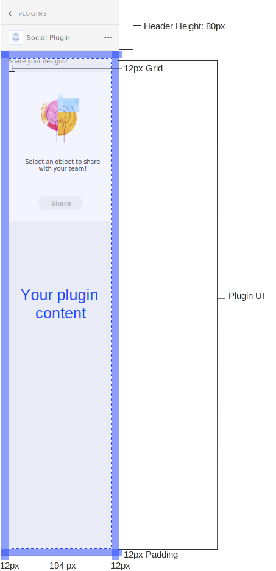
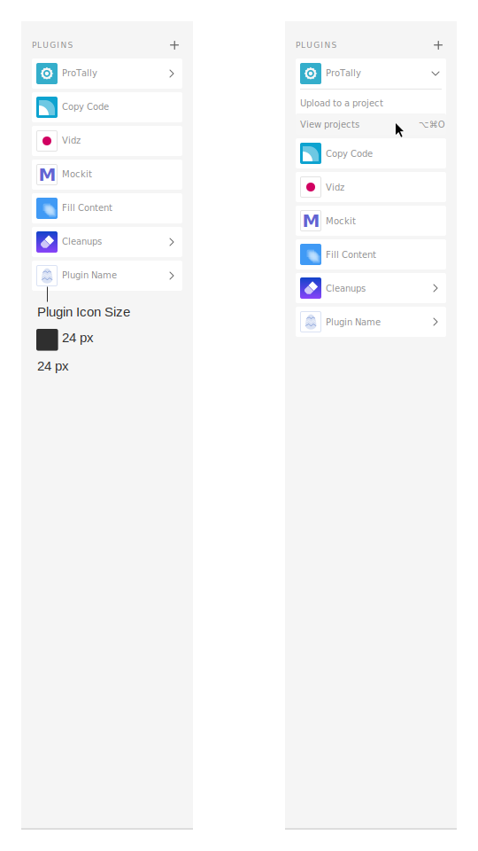
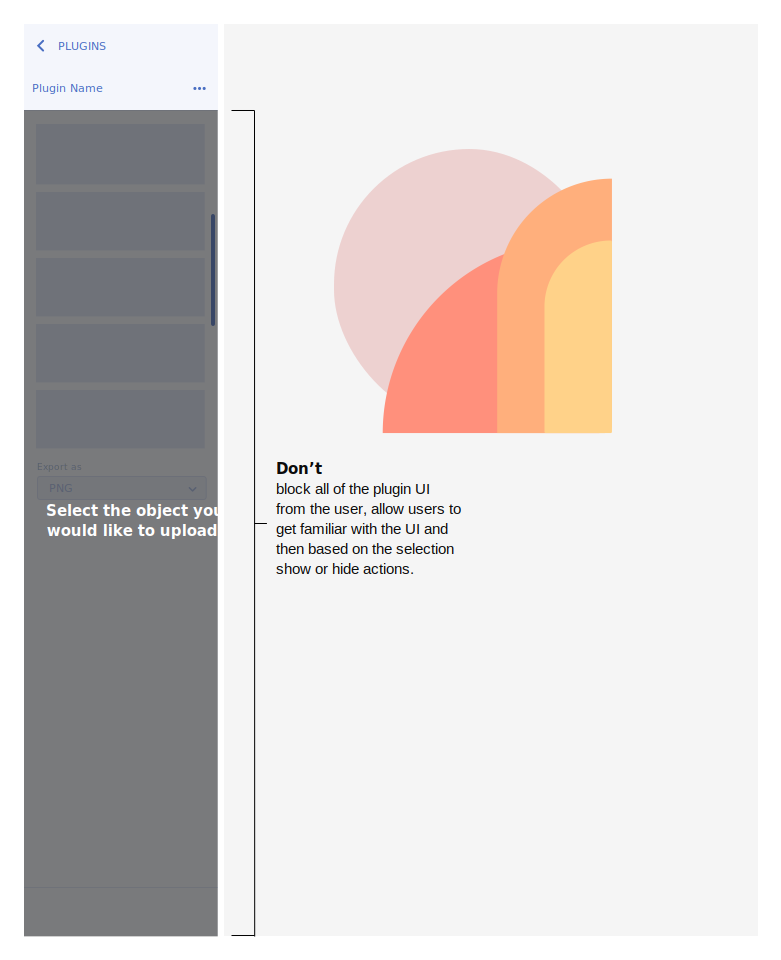
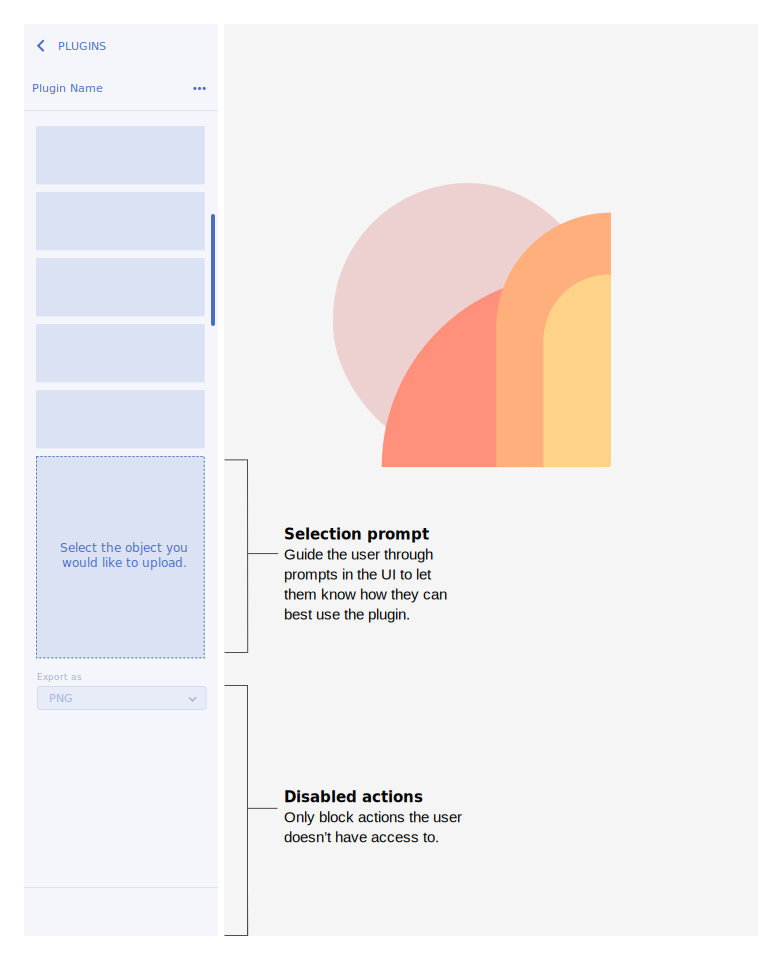

# Plugin Design Guidelines  |  Sticker Sheet

## Getting Started

This sticker sheet will cover the different UI surfaces available to plugins. It also includes examples of UI elements and high level guidelines you can use to build your own plugin.

- Plugins Panel
- Modal Dialog
- Plugin Messaging
- Branding
- Plugin Mac OS UI Kit
- Plugin UWP (windows) UI Kit

## Design the best user experience for your plugin!

Based on your users workflow and the plugin action, different UX and UI guidelines should be considered as you create a plugin.

Plugins can interact with the user at different levels, for example, some plugins will have quick actions which in some use cases won’t render UI, and some will include multiple actions that need UI.

### Plugins Panel (Non-Blocking UI)

This surface is best used when the user should have access to the canvas while using the plugin.

### Modal Dialog (Blocking UI)

This surface is best used when the plugin needs to run an action and the user shouldn’t modify or change selection of objects on the canvas

## XD Plugin User Journey

### 1. User opens plugin

#### Menu bar

#### Panel Launch Pad

#### Keyboard Shortcut

### 2.1 First time using the plugin

#### Onboard the user

Providing users with examples on how to use the plugin can help your user get the most out of the plugin.

### 2.2 If the plugin can’t run

#### Show an alert modal dialog

Plugins must not fail silently. As such, a modal must be used to render messages such as errors

### 3. Using the Plugin UI

- Modal UI
- Panel UI
- No UI

### 4. User runs action

### 5. If the plugin renders something on the canvas or exports succesfully

#### Provide feedback to the user

Ex: Provide the user with feedback when the plugin has rendered a new object on the canvas.

### 6. User is done using the plugin

## Plugin Design Guidelines  |  Plugins Panel

### Plugins Panel (Non-Blocking UI)

If the user needs to have access to the canvas then the plugin panel would be the best option, since it’s contextual to the users selection and allows the user to modify items on their canvas while interacting with the plugin UI.

Documentation

- Specs & UX Requirements
- Plugin Launch Pad & UI
- Contextual Feedback
- Adaptive layouts

### Specs & Requirements

#### MacOS example

#### UX Requirements

Navigation

If the user is drilling down multiple panels, then provide a way for them to navigate back

Login & logout

If the user has to login then provide a way for them to logout through the plugin UI

Refresh

If the plugin needs to refresh for the user to see new information then provide a way for the user to refresh/sync through the plugin UI

### Plugin Launch Pad & UI

#### Launch pad

#### Panel UI

### Contextual feedback

#### Selection based actions

##### Don’t

Don’t block all of the UI. If the plugin has other other plugin actions that are not dependent on a selection, then users should be able to interact those actions.

##### Do

Only disable the actions that are not available, so the user can still interact with other parts of the UI.

Add a selection prompt in the UI to let the user know what they need to select to start using your plugin. 

This also allows users to see and understand the UI before they start using the plugin. 

#### Object selected

Reflect the actions available based on the selection.

If cancelling can happen when user changes selection then limit the number of cancel actions on the panel.

Use cases where the user needs to input a lot of data than allow for a cancel action in the panel UI.

In some use cases let the user know what has been selected by rendering a preview or if they have multiple items selected let them know in the panel UI.

#### Generating an object on the canvas

Provide the user with feedback when the plugin has rendered a new object on the canvas. 

When dropping in multiple items into the canvas then let the user know where the items have been placed. 

Avoid dropping an artboard on top of other artboards.

##### UX feedback examples

- Move viewport to object on the canvas
- Select the new object

#### Running an action & providing feedback

If the plugin is running an action, then let the user know by providing UI elements such as a progress indicator.

This can also be a great opportunity to brand your empty states.

### Adaptive layouts

#### Panel behavior

## Plugin Design Guidelines  |  Modal Dialog

### Modal Dialog (Blocking UI)

If the plugin needs to run an action before the user starts a new action then the modal would be recommended for that use case. 

### Documentation

- Specs & UX Requirements
- Modal Plugin UI
- Alert Dialogs

#### Specs & Requirements

##### MacOS example

#### UX Requirements

##### Header - h1

Have a clear header for the dialog. 
e.g. “name of plugin”, “description of workflow”

##### Dialog Buttons

Include a modal dismissal button to allow the user to cancel/close the modal and a call to action button (blue) to highlight the primary action.

#### Modal dialogs

##### Modal Dialog UI

##### Step process three buttons

##### Step process loader

#### Alert dialogs

This can be used if the plugin needs to alert the user of an error or ask for permission.

##### Information

##### Error

##### Success

##### Permission

### Plugin Design Guidelines  |  Plugin Messaging

WIP...
