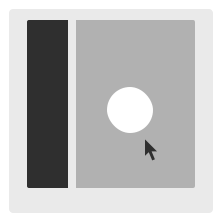
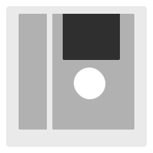
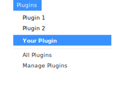
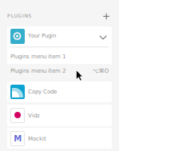
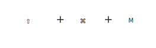

# Plugin Design Guidelines  |  Sticker Sheet

## Getting Started

This sticker sheet will cover the different UI surfaces available to plugins. It also includes examples of UI elements and high level guidelines you can use to build your own plugin.

- Plugins Panel
- Modal Dialog
- Plugin Messaging
- Branding
- Plugin Mac OS UI Kit
- Plugin UWP (windows) UI Kit

## Design the best user experience for your plugin!

Based on your users workflow and the plugin action, different UX and UI guidelines should be considered as you create a plugin.

Plugins can interact with the user at different levels, for example, some plugins will have quick actions which in some use cases won’t render UI, and some will include multiple actions that need UI.

### Plugins Panel (Non-Blocking UI)

This surface is best used when the user should have access to the canvas while using the plugin.

### Modal Dialog (Blocking UI)

This surface is best used when the plugin needs to run an action and the user shouldn’t modify or change selection of objects on the canvas

## XD Plugin User Journey

### 1. User opens plugin

#### Menu bar

#### Panel Launch Pad

#### Keyboard Shortcut

### 2.1 First time using the plugin

#### Onboard the user

Providing users with examples on how to use the plugin can help your user get the most out of the plugin.

### 2.2 If the plugin can’t run

#### Show an alert modal dialog

Plugins must not fail silently. As such, a modal must be used to render messages such as errors

### 3. Using the Plugin UI

#### Modal UI

#### Panel UI

#### No UI

### 4. User runs action

### 5. If the plugin renders something on the canvas or exports succesfully

#### Provide feedback to the user

Ex: Provide the user with feedback when the plugin has rendered a new object on the canvas.

### 6. User is done using the plugin
